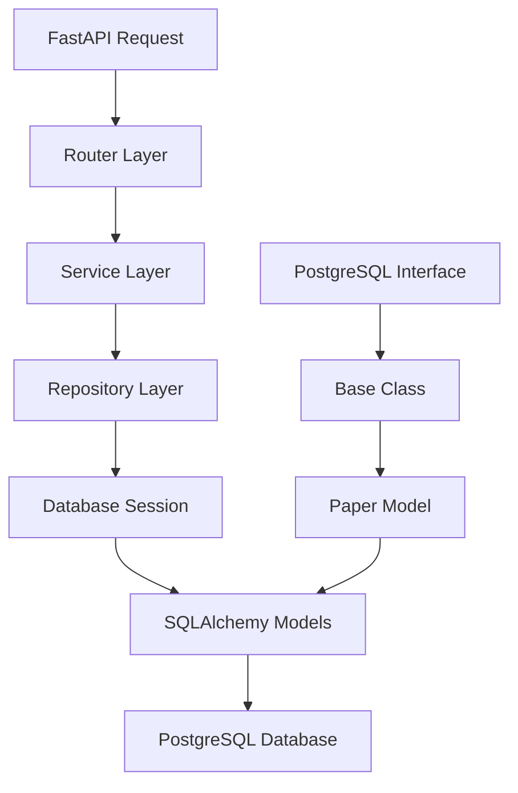

```mermaid
graph TD
    A[FastAPI Request] --> B[Router Layer]
    B --> C[Service Layer]
    C --> D[Repository Layer]
    D --> E[Database Session]
    E --> F[SQLAlchemy Models]
    F --> G[PostgreSQL Database]
    
    H[Paper Model] --> F
    I[Base Class] --> H
    J[PostgreSQL Interface] --> I
```