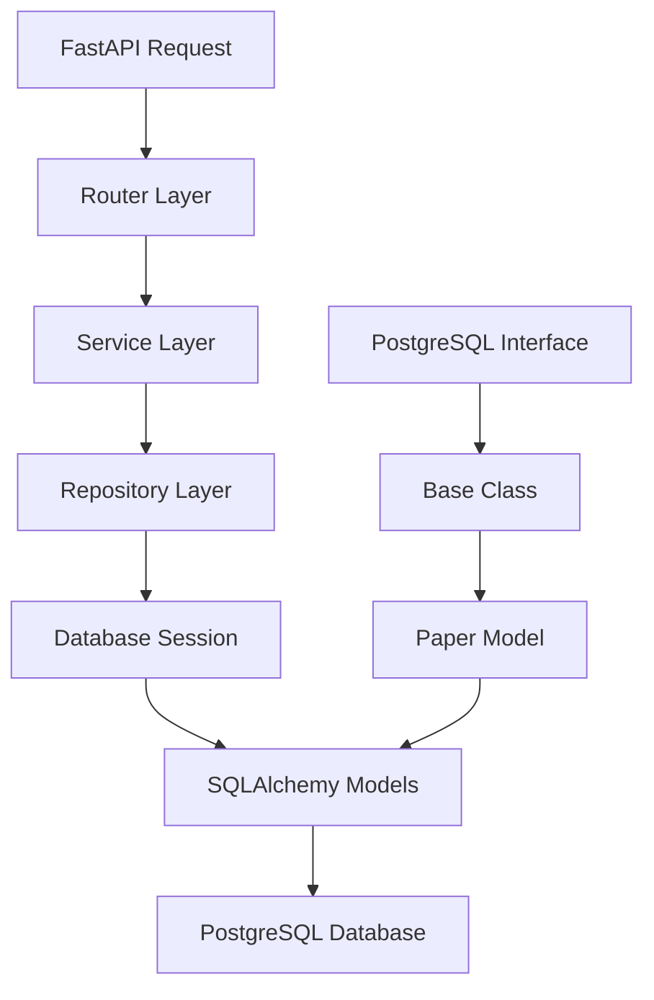

# DATABASE

## Creation
    1 - CONFIGURATION LAYER: Centralized settings management using Pydantic (`config.py`)
    
    2 - ABSTRACT LAYER: This defines the contracts - what any database implementation must provid (`db/base.py`)

    3 - IMPLEMENTATION LAYER: The concrete PostgreSQL implementation (`db/postgresql.sql`)
    
    4 - FACTORY LAYER: This is the orchestrator that puts everything together (`db/factory.py`)

## Data
    1 - MODELS LAYER: Defines what your data looks like in the database (`models/paper.py`)

    2 - REPOSITORY LAYER: Defines how you interact with that data (`repositories/paper.py`)

## How they work together
    1 - Schema → Model Conversion
    
    ```
    # API receives this (Pydantic schema)
    paper_data = PaperCreate(
        arxiv_id="2401.12345",
        title="Amazing AI Paper",
        authors=["Dr. Smith", "Prof. Jones"],
        abstract="This paper discusses...",
        categories=["cs.AI", "cs.LG"],
        published_date=datetime(2024, 1, 15),
        pdf_url="https://arxiv.org/pdf/2401.12345.pdf"
    )

    # Repository converts to SQLAlchemy model
    db_paper = Paper(**paper_data.model_dump())
    ```