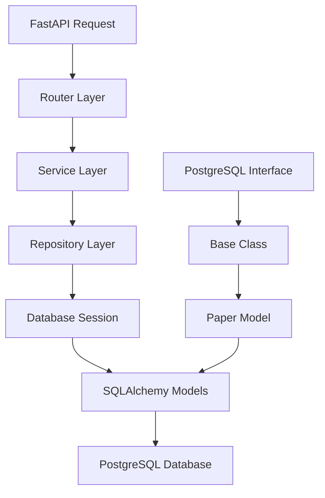

# DATABASE

## Creation
    1 - CONFIGURATION LAYER: Centralized settings management using Pydantic (`config.py`)
    
    2 - ABSTRACT LAYER: This defines the contracts - what any database implementation must provid (`db/base.py`)

    3 - IMPLEMENTATION LAYER: The concrete PostgreSQL implementation (`db/postgresql.sql`)
    
    4 - FACTORY LAYER: This is the orchestrator that puts everything together (`db/factory.py`)

## Data
    1 - MODELS LAYER: Defines what your data looks like in the database (`models/paper.py`)

    2 - REPOSITORY LAYER: Defines how you interact with that data (`repositories/paper.py`)

# 🏆 Software Engineering Best Practices You've Implemented
1. SOLID Principles
- Single Responsibility: Each class has one clear purpose
- Open/Closed: Easy to extend with new database types
- Liskov Substitution: BaseDatabase can be swapped out
- Interface Segregation: Clean, focused interfaces
Dependency Inversion: High-level modules don't depend on low-level details
2. Design Patterns
- Factory Pattern: make_database() function
- Repository Pattern: BaseRepository abstract class
- Strategy Pattern: Different database implementations
- Dependency Injection: Configuration passed through constructors
3. Code Quality
- Type Hints: Full type annotation coverage
- Error Handling: Proper exception management
- Logging: Structured logging throughout
- Documentation: Clear docstrings and comments
- Configuration Management: Environment-based settings
4. Infrastructure as Code
- Docker: Reproducible environments
- Docker Compose: Service orchestration
- Volume Management: Persistent data storage
- Network Configuration: Service communication
